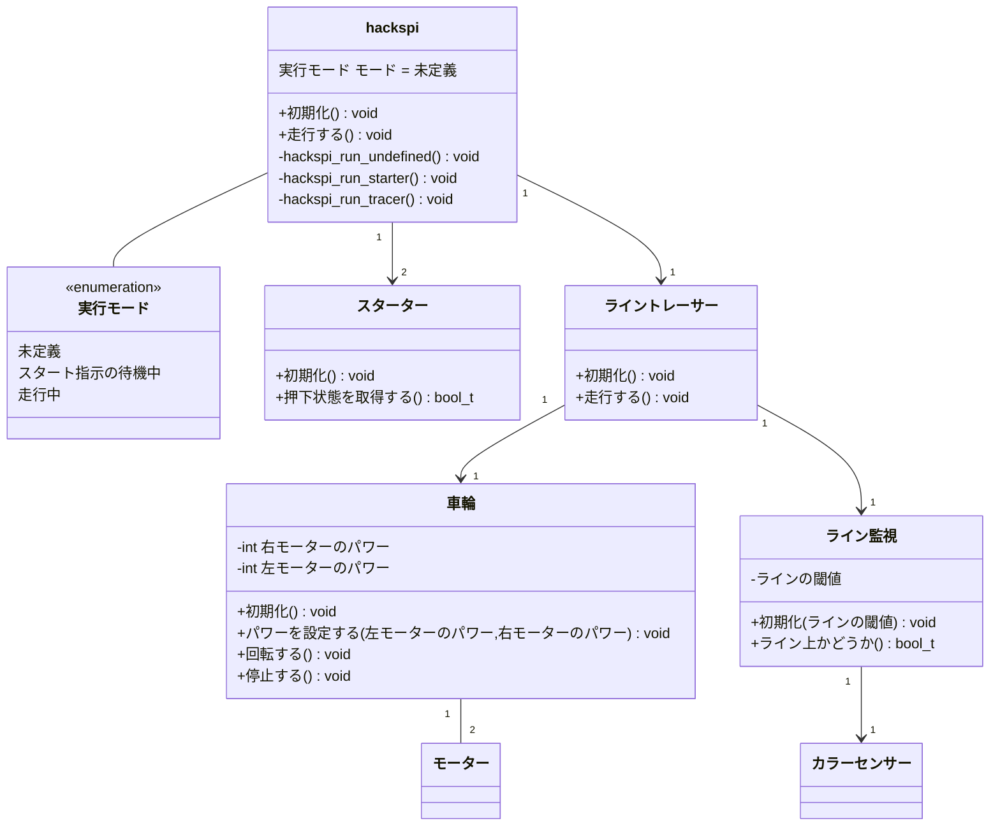
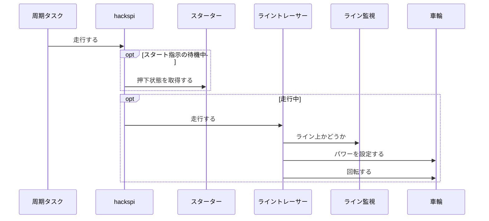
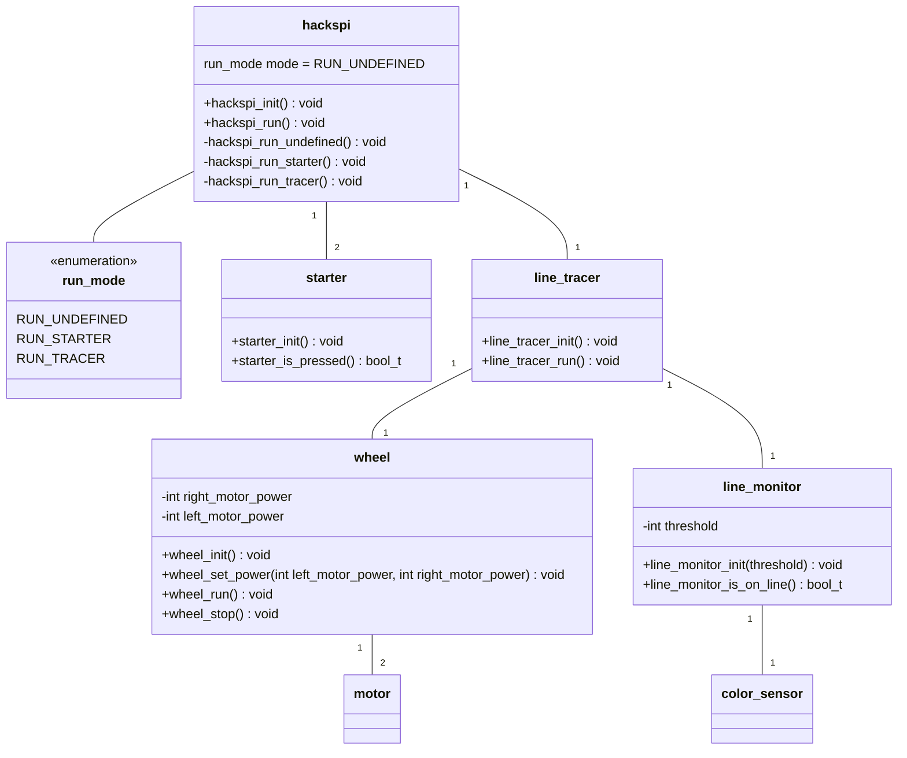

# raspike-app

# 設計図

## 日本語

### ユースケース図

### クラス図

```mermaid
classDiagram
  class 実行モード {
    <<enumeration>>
    未定義
    スタート指示の待機中
    走行中
  }
  class hackspi {
    実行モード モード = 未定義
    +初期化() void
    +走行する() void
    -hackspi_run_undefined() void
    -hackspi_run_starter() void
    -hackspi_run_tracer() void
  }

  class スターター {
    +初期化() void
    +押下状態を取得する() bool_t
  }

  class 車輪 {
    -int 右モーターのパワー
    -int 左モーターのパワー
    +初期化() void
    +パワーを設定する(左モーターのパワー,右モーターのパワー) void
    +回転する() void
    +停止する() void
  }

  class ライントレーサー {
    +初期化() void
    +走行する() void
  }

  class ライン監視 {
    -ラインの閾値
    +初期化(ラインの閾値) void
    +ライン上かどうか() bool_t
  }

  hackspi -- 実行モード
  hackspi "1"-->"2" スターター
  hackspi "1"-->"1" ライントレーサー
  ライントレーサー "1"-->"1" 車輪
  ライントレーサー "1"-->"1" ライン監視
  ライン監視 "1"-->"1" カラーセンサー
  車輪 "1"--"2" モーター
```

### シーケンス図

```mermaid
sequenceDiagram
  周期タスク->>hackspi: 走行する
  opt スタート指示の待機中
    hackspi->>スターター: 押下状態を取得する
  end
  opt 走行中
    hackspi->>ライントレーサー: 走行する
    ライントレーサー->>ライン監視: ライン上かどうか
    ライントレーサー->>車輪: パワーを設定する
    ライントレーサー->>車輪: 回転する
  end
```

## 英語

### クラス図

```mermaid
classDiagram
  class run_mode {
    <<enumeration>>
    RUN_UNDEFINED
    RUN_STARTER
    RUN_TRACER
  }
  class hackspi {
    run_mode mode = RUN_UNDEFINED
    +hackspi_init() void
    +hackspi_run() void
    -hackspi_run_undefined() void
    -hackspi_run_starter() void
    -hackspi_run_tracer() void
  }

  class starter {
    +starter_init() void
    +starter_is_pressed() bool_t
  }

  class wheel {
    -int right_motor_power
    -int left_motor_power
    +wheel_init() void
    +wheel_set_power(int left_motor_power, int right_motor_power) void
    +wheel_run() void
    +wheel_stop() void
  }

  class line_tracer {
    +line_tracer_init() void
    +line_tracer_run() void
  }

  class line_monitor {
    -int threshold
    +line_monitor_init(threshold) void
    +line_monitor_is_on_line() bool_t
  }

  hackspi -- run_mode
  hackspi "1"--"2" starter
  hackspi "1"--"1" line_tracer
  line_tracer "1"--"1" wheel
  line_tracer "1"--"1" line_monitor
  line_monitor "1"--"1" color_sensor
  wheel "1"--"2" motor
```
