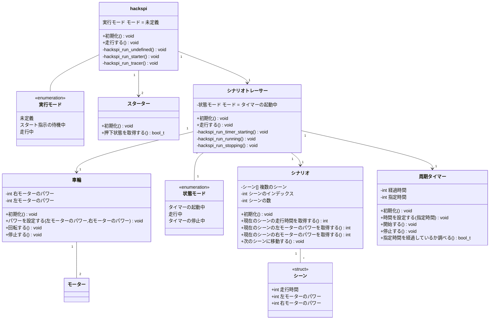
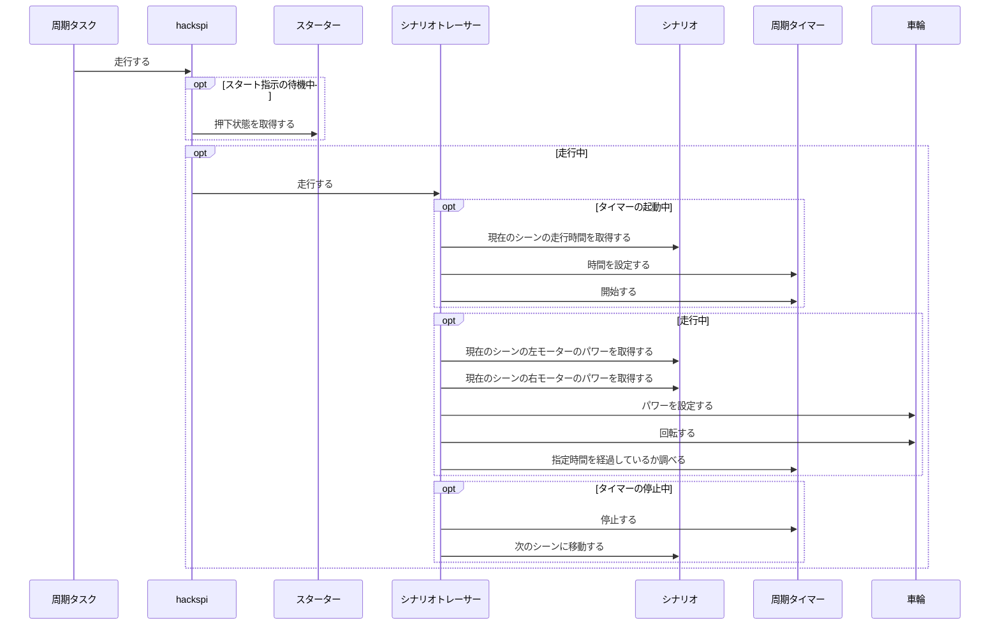
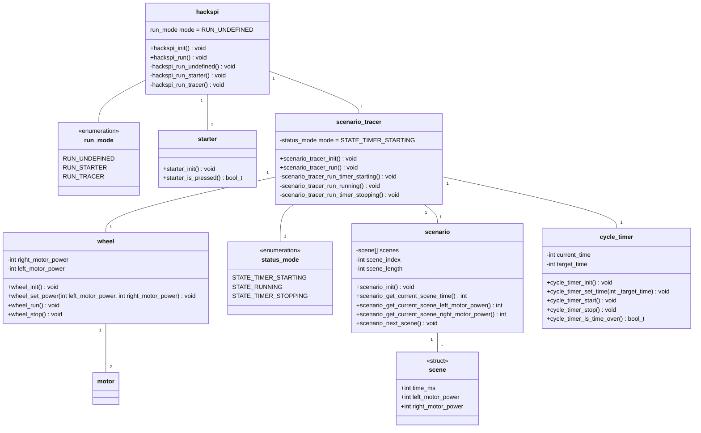

# raspike-app

# 設計図

## 日本語

### ユースケース図

### クラス図

```mermaid
classDiagram
  class 実行モード {
    <<enumeration>>
    未定義
    スタート指示の待機中
    走行中
  }
  class hackspi {
    実行モード モード = 未定義
    +初期化() void
    +走行する() void
    -hackspi_run_undefined() void
    -hackspi_run_starter() void
    -hackspi_run_tracer() void
  }

  class スターター {
    +初期化() void
    +押下状態を取得する() bool_t
  }

  class 車輪 {
    -int 右モーターのパワー
    -int 左モーターのパワー
    +初期化() void
    +パワーを設定する(左モーターのパワー,右モーターのパワー) void
    +回転する() void
    +停止する() void
  }

  class シナリオトレーサー {
    -状態モード モード = タイマーの起動中
    +初期化() void
    +走行する() void
    -hackspi_run_timer_starting() void
    -hackspi_run_running() void
    -hackspi_run_stopping() void
  }

  class 状態モード {
    <<enumeration>>
    タイマーの起動中
    走行中
    タイマーの停止中
  }

  class シナリオ {
    -シーン[] 複数のシーン
    -int シーンのインデックス
    -int シーンの数
    +初期化() void
    +現在のシーンの走行時間を取得する() int
    +現在のシーンの左モーターのパワーを取得する() int
    +現在のシーンの右モーターのパワーを取得する() int
    +次のシーンに移動する() void
  }

  class シーン {
    <<struct>>
    +int 走行時間
    +int 左モーターのパワー
    +int 右モーターのパワー
  }

  class 周期タイマー {
    -int 経過時間
    -int 指定時間
    +初期化() void
    +時間を設定する(指定時間) void
    +開始する() void
    +停止する() void
    +指定時間を経過しているか調べる() bool_t
  }


  hackspi -- 実行モード
  hackspi "1"-->"2" スターター
  hackspi "1"-->"1" シナリオトレーサー
  シナリオトレーサー "1"-->"1" 車輪
  シナリオトレーサー "1"-->"1" シナリオ
  シナリオトレーサー "1"-->"1" 周期タイマー
  シナリオ "1"--"*" シーン
  シナリオトレーサー "1"--"1" 状態モード
  車輪 "1"--"2" モーター
```

### シーケンス図

```mermaid
sequenceDiagram
  周期タスク->>hackspi: 走行する

  opt スタート指示の待機中
    hackspi->>スターター: 押下状態を取得する
  end

  opt 走行中
    hackspi->>シナリオトレーサー: 走行する

    opt タイマーの起動中
      シナリオトレーサー->>シナリオ: 現在のシーンの走行時間を取得する
      シナリオトレーサー->>周期タイマー: 時間を設定する
      シナリオトレーサー->>周期タイマー: 開始する
    end
    opt 走行中
      シナリオトレーサー->>シナリオ: 現在のシーンの左モーターのパワーを取得する
      シナリオトレーサー->>シナリオ: 現在のシーンの右モーターのパワーを取得する
      シナリオトレーサー->>車輪: パワーを設定する
      シナリオトレーサー->>車輪: 回転する
      シナリオトレーサー->>周期タイマー: 指定時間を経過しているか調べる
    end
    opt タイマーの停止中
      シナリオトレーサー->>周期タイマー: 停止する
      シナリオトレーサー->>シナリオ: 次のシーンに移動する
    end
  end
```

## 英語

### クラス図

```mermaid
classDiagram
  class run_mode {
    <<enumeration>>
    RUN_UNDEFINED
    RUN_STARTER
    RUN_TRACER
  }
  class hackspi {
    run_mode mode = RUN_UNDEFINED
    +hackspi_init() void
    +hackspi_run() void
    -hackspi_run_undefined() void
    -hackspi_run_starter() void
    -hackspi_run_tracer() void
  }

  class starter {
    +starter_init() void
    +starter_is_pressed() bool_t
  }

  class wheel {
    -int right_motor_power
    -int left_motor_power
    +wheel_init() void
    +wheel_set_power(int left_motor_power, int right_motor_power) void
    +wheel_run() void
    +wheel_stop() void
  }

  class scenario_tracer {
    -status_mode mode = STATE_TIMER_STARTING
    +scenario_tracer_init() void
    +scenario_tracer_run() void
    -scenario_tracer_run_timer_starting() void
    -scenario_tracer_run_running() void
    -scenario_tracer_run_timer_stopping() void
  }

  class status_mode {
    <<enumeration>>
    STATE_TIMER_STARTING
    STATE_RUNNING
    STATE_TIMER_STOPPING
  }

  class scenario {
    -scene[] scenes
    -int scene_index
    -int scene_length
    +scenario_init() void
    +scenario_get_current_scene_time() int
    +scenario_get_current_scene_left_motor_power() int
    +scenario_get_current_scene_right_motor_power() int
    +scenario_next_scene() void
  }

  class scene {
    <<struct>>
    +int time_ms
    +int left_motor_power
    +int right_motor_power
  }

  class cycle_timer {
    -int current_time
    -int target_time
    +cycle_timer_init() void
    +cycle_timer_set_time(int _target_time) void
    +cycle_timer_start() void
    +cycle_timer_stop() void
    +cycle_timer_is_time_over() bool_t
  }

  hackspi -- run_mode
  hackspi "1"--"2" starter
  hackspi "1"--"1" scenario_tracer
  scenario_tracer "1"--"1" wheel
  scenario_tracer "1"--"1" scenario
  scenario_tracer "1"--"1" cycle_timer
  scenario_tracer "1"--"1" status_mode
  scenario "1"--"*" scene
  wheel "1"--"2" motor
```
